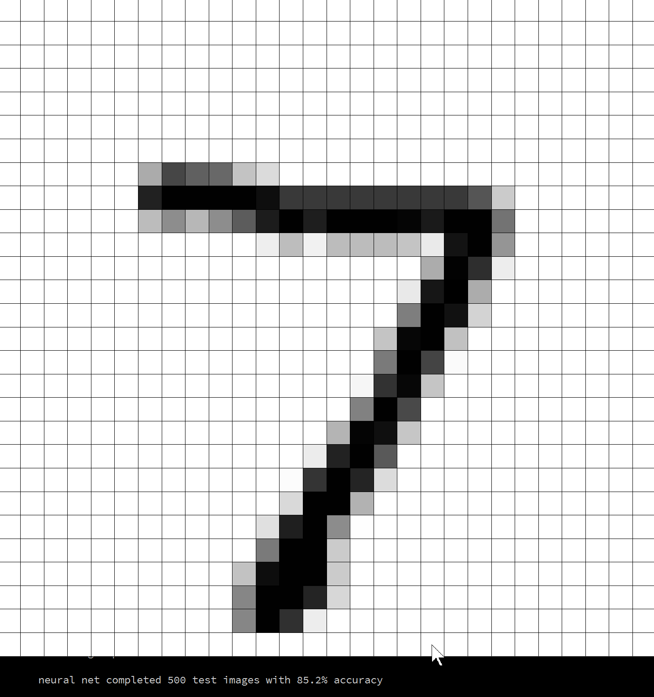
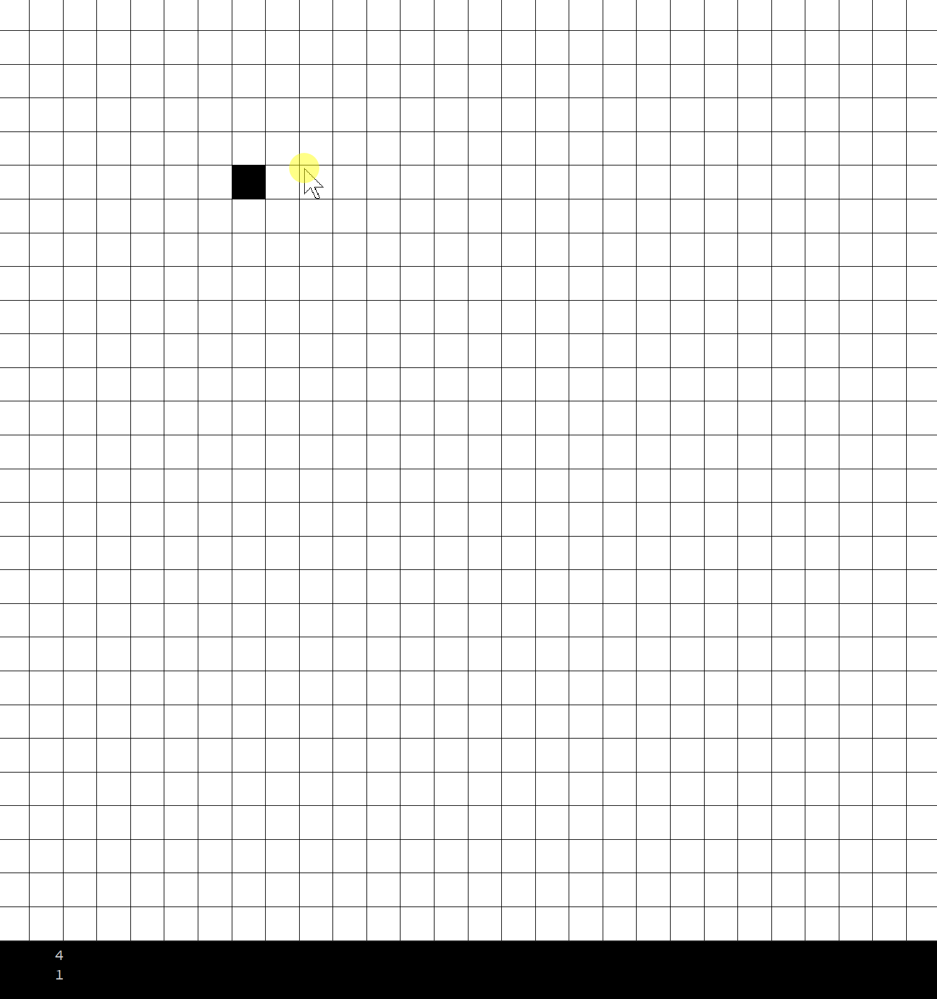

# MNIST-neural-network

Simple neural network trained on the MNIST handwritten digits dataset. Scores about 85% accuracy when trained on 10,000 images and tested against a test set of size 500. built using Processing 3.0 in order to get an easy visual representation of what's going on. This also allows the user to test the neural network against their own handwritten digits.

### Controls

The neural network is trained everytime the program is run (unfortunatly I didn't implement a way to save an instance of the neural network). once it has trained: 
- draw your own digits by pressing (and holding) the left mouse button (reset your drawing by pressing the R key)
- alternatively, you can load in images from the test set by pressing the C key
- let the neural network guess which number it is by pressing the g key, the result is displayed in the terminal

Here is an example of using the C key to load in images from the mnist dataset

It might a bit small, but in the bottom left you can see the neural netwoks guesses of which digit is displayed

An example of drawing your own digits:

As you can see, the neural network performs a lot worse on user drawn digits (probably because they haven't been normalized like the digits in the MNIST dataset)

### technical details

- supports any number of input and output nodes, as well of any number of hidden layers (and their respective amount of nodes)
- uses the the feed forward algorithm to produce results, uses back propogation algorithm to train
- uses sigmoid as an activation function
